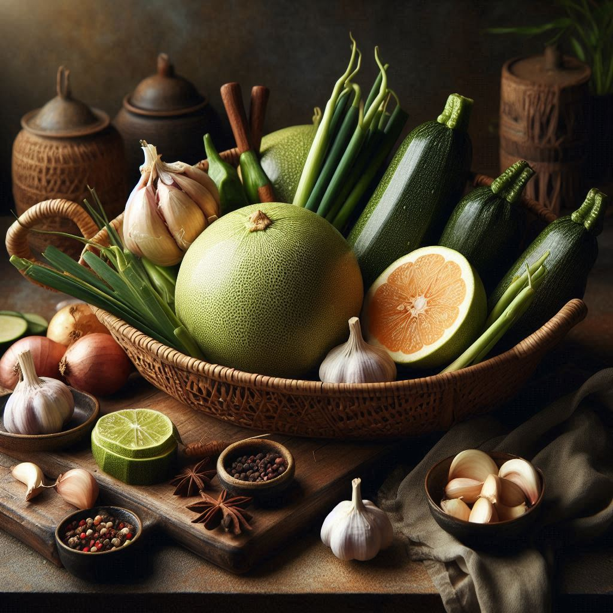
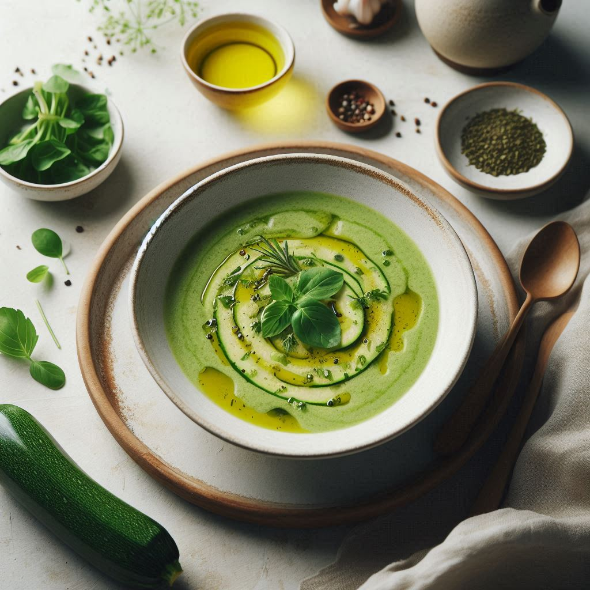
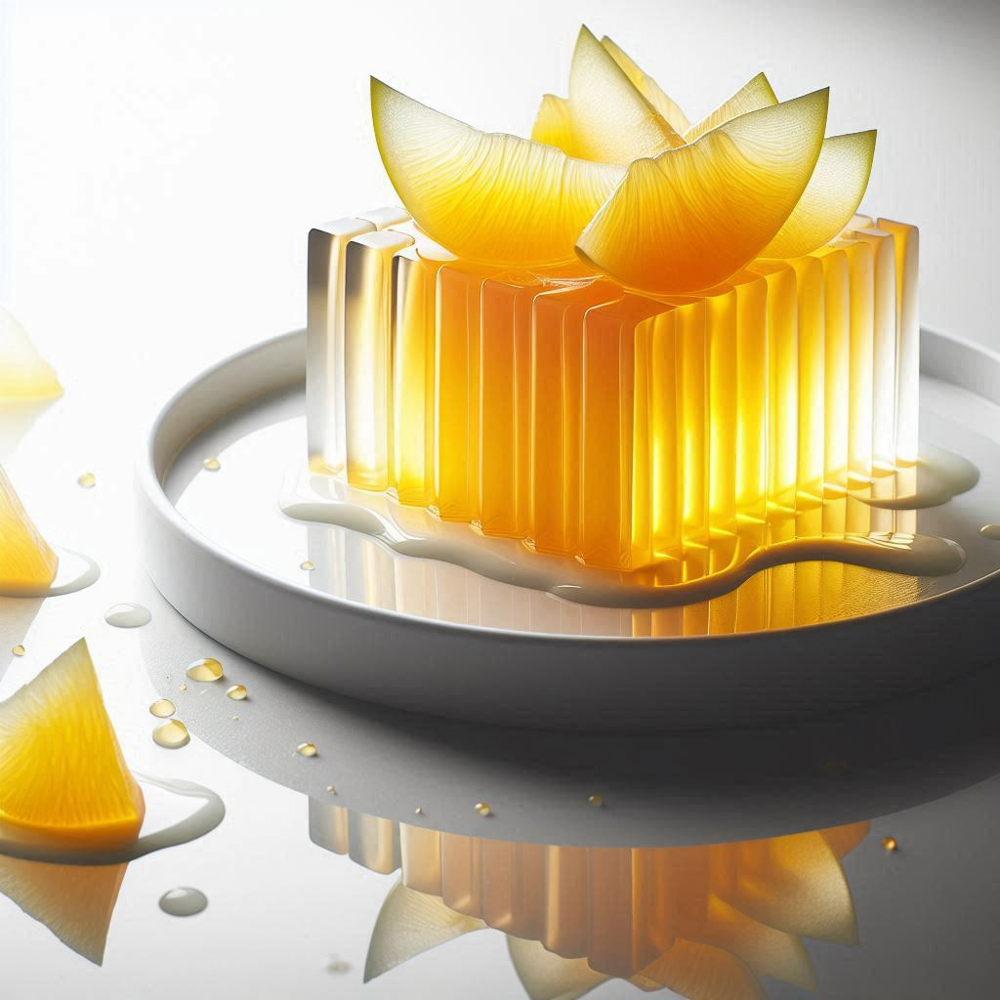

# Khám Phá Hương Vị Tươi Mát: Thực Đơn Chay Bưởi Và Bí Xanh

Trong không khí thanh tịnh của những ngày chay, chúng ta luôn tìm kiếm những trải nghiệm ẩm thực vừa độc đáo vừa lành mạnh. Thực đơn chay này sử dụng **trái bưởi** và **bí xanh** – những nguyên liệu quen thuộc nhưng được biến tấu theo cách sáng tạo để mang đến những hương vị mới lạ, kết hợp giữa thanh mát, ngọt tự nhiên và đậm đà.

## Sự Hài Hòa Giữa Vị Ngọt, Chua, Giòn Và Thanh Mát

Thực đơn được chia thành các phần chính:

- **Khai vị:** Súp Bí Xanh Mát Lạnh
- **Món chính:** 
  - Bưởi Kho Chay
  - Bưởi Chiên Giòn
- **Canh phụ:** Canh Bí Xanh Nấu Nấm
- **Tráng miệng:** Thạch Bưởi Mát Lạnh

Mỗi món ăn trong thực đơn đều được chế biến tỉ mỉ để giữ trọn hương vị tự nhiên của các nguyên liệu, đồng thời đảm bảo dinh dưỡng tối ưu.

---

## Công Thức Chi Tiết

### 1. Nước Dùng Rau Củ
**Nguyên liệu:**
- 1 củ cà rốt (cắt khúc)
- 1 củ hành tây (cắt đôi)
- 1 cây cần tây (cắt khúc)
- 1 củ cải trắng (tuỳ chọn, cắt khúc)
- 1 vài lá nguyệt quế (tuỳ chọn)
- 1 nhúm tiêu
- 1-2 lít nước

**Cách làm:**
1. Rửa sạch tất cả các loại rau củ, cắt miếng to.
2. (Tùy chọn) Xào sơ rau củ với một chút dầu ăn để tăng hương vị.
3. Cho rau củ vào nồi, đổ nước sao cho ngập rau.
4. Đun sôi, sau đó hạ lửa nhỏ và nấu liu riu trong 30–45 phút.
5. Lọc bỏ xác rau củ, giữ lại phần nước dùng dùng cho các món sau.

---

### 2. Súp Bí Xanh Mát Lạnh (Khai vị)

**Nguyên liệu:**
- 300g bí xanh (gọt vỏ, cắt miếng)
- 500ml nước dùng rau củ (xem hướng dẫn ở phần 1)
- 2 lát gừng
- 50ml sữa hạt (hạnh nhân, đậu nành, hoặc sữa dừa)
- Muối, tiêu, dầu oliu

**Cách làm:**
1. Cho bí xanh và gừng vào nồi cùng nước dùng rau củ. Đun sôi và nấu cho đến khi bí xanh mềm (khoảng 10–15 phút).
2. Vớt gừng ra, cho bí xanh vào máy xay và xay nhuyễn hỗn hợp.
3. Thêm sữa hạt, nêm muối và tiêu theo khẩu vị.
4. Rắc thêm một chút dầu oliu khi dọn ra bát. Món súp có thể dùng ấm hoặc sau khi làm mát.

---

### 3. Bưởi Kho Chay (Món chính)

**Nguyên liệu:**
- 1 chén múi bưởi (bóc tách, loại bỏ hạt)
- 100g nấm đông cô (hoặc các loại nấm khác, ngâm mềm, thái lát)
- 200g đậu hũ (cắt miếng nhỏ, chiên sơ)
- 2 muỗng canh nước tương
- 1 muỗng cà phê đường
- Một ít hạt tiêu và ớt băm (tuỳ khẩu vị)
- 1 củ hành hoặc vài nhánh hành lá (phi thơm)
- Dầu ăn

**Cách làm:**
1. Phi thơm hành (hoặc hành lá) với dầu ăn trên chảo cho đến khi vàng.
2. Cho nấm và đậu hũ vào xào nhanh trong khoảng 2–3 phút.
3. Thêm nước tương, đường và một chút nước (nếu cần) để tạo nước sốt.
4. Nhẹ nhàng cho múi bưởi vào, đảo nhẹ để bưởi thấm vị nhưng không bị nát.
5. Hạ lửa nhỏ, kho cho đến khi nước sốt cạn sệt. Nêm lại với hạt tiêu và ớt.
6. Dùng nóng cùng với cơm.

---

### 4. Bưởi Chiên Giòn (Món chính)

**Nguyên liệu:**
- 1 chén múi bưởi (bóc sẵn, giữ nguyên hình dáng)
- 1/2 chén bột chiên giòn
- 1/4 chén nước lạnh hoặc nước soda
- Dầu ăn (đủ để chiên ngập)
- Nước sốt ăn kèm: mayonnaise chay, tương ớt, hoặc nước tương

**Cách làm:**
1. Trộn bột chiên giòn với nước lạnh hoặc soda cho đến khi hỗn hợp đạt độ sệt vừa.
2. Nhúng từng múi bưởi vào hỗn hợp bột sao cho bột bao phủ đều.
3. Đun nóng dầu trong chảo với lửa vừa, chiên các múi bưởi cho đến khi chuyển sang màu vàng giòn.
4. Vớt bưởi ra, để ráo dầu trên giấy thấm.
5. Dùng kèm với nước sốt chay yêu thích.

---

### 5. Canh Bí Xanh Nấu Nấm (Canh phụ)

**Nguyên liệu:**
- 300g bí xanh (gọt vỏ, cắt miếng vừa ăn)
- 150g nấm (nấm hương, nấm rơm hoặc nấm kim châm; nếu dùng nấm khô thì cần ngâm mềm, thái lát)
- 500ml nước dùng rau củ (xem phần 1)
- 2 lát gừng
- Muối, tiêu
- Hành lá và ngò (cắt nhỏ) để trang trí

**Cách làm:**
1. Đun sôi nước dùng rau củ cùng vài lát gừng trong nồi.
2. Thêm bí xanh vào, nấu khoảng 5 phút cho đến khi bí mềm vừa phải.
3. Cho nấm vào, nêm muối và tiêu, nấu thêm khoảng 2 phút.
4. Tắt bếp, rắc hành lá và ngò lên trên để trang trí.

---

### 6. Thạch Bưởi Mát Lạnh (Tráng miệng)

**Nguyên liệu:**
- 200ml nước ép bưởi (vắt tươi)
- 1 gói bột rau câu (agar agar)
- 1 muỗng canh đường (điều chỉnh theo khẩu vị)
- Múi bưởi nhỏ (bóc tách, dùng làm topping)

**Cách làm:**
1. Hòa tan bột rau câu với một ít nước và đường. Đun nóng hỗn hợp cho đến khi bột rau câu tan hoàn toàn.
2. Thêm nước ép bưởi vào, khuấy đều.
3. Đổ hỗn hợp vào khuôn, sau đó xếp nhẹ các múi bưởi lên trên.
4. Để nguội, rồi cho vào tủ lạnh ít nhất 2–3 giờ cho đến khi hỗn hợp đông cứng.
5. Cắt miếng vừa ăn và thưởng thức món tráng miệng mát lạnh.

---

## Bảng Tổng Hợp Thực Đơn

| Phần           | Món ăn                   | Nguyên liệu chính                                          | Ghi chú                                                                       |
|----------------|--------------------------|------------------------------------------------------------|-------------------------------------------------------------------------------|
| **Khai vị**    | Súp Bí Xanh Mát Lạnh     | Bí xanh, nước dùng rau củ, gừng, sữa hạt, dầu oliu          | Súp mịn, thanh mát; dùng nóng hoặc lạnh                                        |
| **Món chính**  | Bưởi Kho Chay            | Bưởi, nấm đông cô, đậu hũ, nước tương, đường, hành, tiêu      | Kho nhẹ, đảo nhẹ để giữ nguyên hình dáng bưởi                                  |
| **Món chính**  | Bưởi Chiên Giòn          | Bưởi, bột chiên giòn, nước lạnh/soda, dầu ăn                 | Chiên vàng giòn; ăn kèm nước sốt chay                                          |
| **Canh phụ**   | Canh Bí Xanh Nấu Nấm     | Bí xanh, nấm, nước dùng rau củ, gừng, hành lá, ngò, muối, tiêu | Canh nhẹ, thanh mát; giúp cân bằng hương vị các món chính                     |
| **Tráng miệng**| Thạch Bưởi Mát Lạnh      | Nước ép bưởi, bột rau câu, đường, múi bưởi (topping)         | Món tráng miệng mát lạnh, giải khát; cần để lạnh đủ thời gian cho hỗn hợp đông    |

---

*Lưu ý:*  
- Bạn có thể điều chỉnh lượng gia vị, thời gian nấu và các thành phần theo khẩu vị cá nhân.  
- Việc sử dụng nước dùng rau củ tự nhiên làm nền giúp các món ăn hướng tới vị thanh ngọt và đảm bảo dinh dưỡng tối ưu.

Hy vọng thực đơn này sẽ mang lại cảm hứng cho những bữa ăn chay đầy sáng tạo, bổ dưỡng và tràn ngập hương vị tự nhiên!
