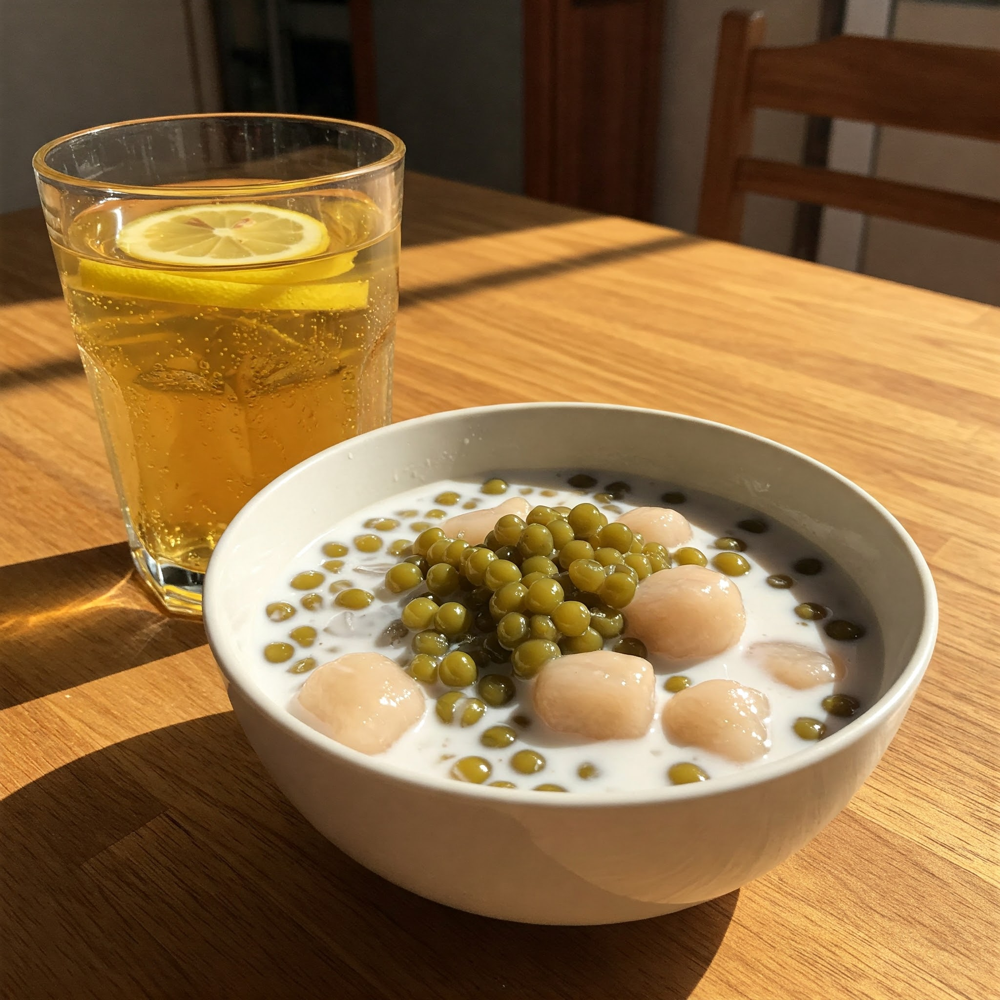

# Thực Đơn Bữa Tối Rau Muống Thịnh Soạn

**Hãy cùng tận hưởng một bữa tối ấm cúng, nơi rau muống - loại rau quen thuộc trong mỗi gian bếp Việt - được sáng tạo thành những món ăn phong phú và hấp dẫn. Thực đơn này là sự kết hợp giữa hương vị truyền thống và nét sáng tạo hiện đại, mang đến trải nghiệm ẩm thực độc đáo từ những món khai vị nhẹ nhàng, món chính đậm đà, đến món tráng miệng ngọt ngào. Hãy để bữa ăn tối này không chỉ làm ấm lòng mà còn lưu giữ những khoảnh khắc đáng nhớ bên gia đình và bạn bè.**

---

## Khai Vị

### 1. Gỏi Rau Muống Tôm Thịt
*Món gỏi chua ngọt, giòn ngon, kết hợp rau muống tươi mát, tôm thịt đậm đà.*

- **Nguyên liệu**:
  - Rau muống: 400g  
  - Tôm tươi: 300g  
  - Thịt ba chỉ: 200g  
  - Cà rốt: 1 củ nhỏ (150g)  
  - Dưa leo: 1 quả (200g)  
  - Đậu phộng rang: 50g  
  - Nước mắm: 3 muỗng canh  
  - Đường: 2 muỗng canh  
  - Chanh: 2 quả  
  - Tỏi: 2 tép  
  - Ớt: 1 quả (tùy khẩu vị)  

- **Cách làm**:  
  1. Rau muống chần sơ qua nước sôi, để ráo, cắt khúc 5cm.  
  2. Luộc chín tôm và thịt ba chỉ, cắt miếng vừa ăn.  
  3. Cà rốt, dưa leo bào sợi, trộn đều với rau muống, tôm thịt.  
  4. Pha nước mắm chua ngọt từ nước mắm, đường, nước cốt chanh, tỏi, và ớt.  
  5. Trộn đều hỗn hợp rau củ, tôm thịt với nước mắm. Rắc đậu phộng lên trên.

### 2. Nem Rau Muống Chiên Giòn
*Món nem với nhân rau muống giòn ngọt, thịt băm, chiên vàng ruộm.*

- **Nguyên liệu**:  
  - Rau muống: 300g  
  - Thịt băm: 300g  
  - Nấm mèo: 50g  
  - Hành tây: 1/2 củ nhỏ  
  - Trứng gà: 1 quả  
  - Bánh tráng: 20 miếng  
  - Gia vị: muối, tiêu, hạt nêm  

- **Cách làm**:  
  1. Rau muống, nấm mèo, hành tây băm nhỏ.  
  2. Trộn đều rau, thịt băm, nấm, hành, thêm trứng và nêm gia vị.  
  3. Cuốn nem và chiên vàng ở lửa vừa.  

---

## Món Chính

### 1. Rau Muống Xào Tỏi
*Món ăn quen thuộc, đơn giản nhưng hấp dẫn.*

- **Nguyên liệu**:  
  - Rau muống: 700g  
  - Tỏi: 5 tép  
  - Dầu ăn: 3 muỗng canh  
  - Gia vị: muối, hạt nêm  

- **Cách làm**:  
  1. Phi thơm tỏi băm với dầu.  
  2. Cho rau muống vào xào nhanh tay.  
  3. Nêm muối và hạt nêm vừa ăn.

### 2. Canh Rau Muống Thịt Bằm Chua Cay
*Món canh chua cay thanh mát.*

- **Nguyên liệu**:  
  - Rau muống: 500g  
  - Thịt bằm: 250g  
  - Cà chua: 2 quả  
  - Dứa: 1/2 quả nhỏ  
  - Hành tím: 2 củ  
  - Gia vị: muối, đường, nước mắm  

- **Cách làm**:  
  1. Phi hành tím, xào thịt băm.  
  2. Thêm cà chua, dứa và nước, đun sôi.  
  3. Thả rau muống vào, nêm nếm chua cay.

### 3. Gà Kho Gừng
*Món ăn ấm bụng, với thịt gà mềm thơm, đậm đà hương vị gừng cay nồng.*

- **Nguyên liệu**:  
  - Gà: 1 con (khoảng 1.2kg)  
  - Gừng: 1 củ  
  - Hành tím: 3 củ  
  - Tỏi: 2 tép  
  - Nước mắm: 3 muỗng canh  
  - Đường: 2 muỗng canh  
  - Dầu ăn: 3 muỗng canh  

- **Cách làm**:  
  1. Ướp gà với gừng, hành tím, tỏi băm, nước mắm, đường trong 15 phút.  
  2. Phi thơm gừng, hành, tỏi, sau đó cho gà vào kho.  
  3. Đun ở lửa vừa đến khi gà chín mềm và nước sốt sánh lại.

---

## Món Phụ

### Rau Muống Luộc Chấm Kho Quẹt
*Rau luộc giòn ngọt, ăn cùng kho quẹt đậm đà.*

- **Nguyên liệu**:  
  - Rau muống: 800g  
  - Thịt ba chỉ: 100g  
  - Tôm khô: 50g  
  - Nước mắm: 3 muỗng canh  

- **Cách làm**:  
  1. Luộc rau muống vừa chín tới.  
  2. Làm kho quẹt từ thịt, tôm khô, nước mắm.

---

## Món Tráng Miệng

### Chè Đậu Xanh
*Món chè ngọt thanh với nước cốt dừa.*

- **Nguyên liệu**:  
  - Đậu xanh: 200g  
  - Đường: 150g  
  - Nước cốt dừa: 200ml  

- **Cách làm**:  
  1. Nấu đậu xanh mềm, thêm đường.  
  2. Thêm nước cốt dừa, khuấy đều.

---

## Đồ Uống
- Nước sâm  
- Trà đá  
- Nước ngọt  

---

*Hãy cùng gia đình thưởng thức bữa tối ngon lành và đong đầy yêu thương này!*