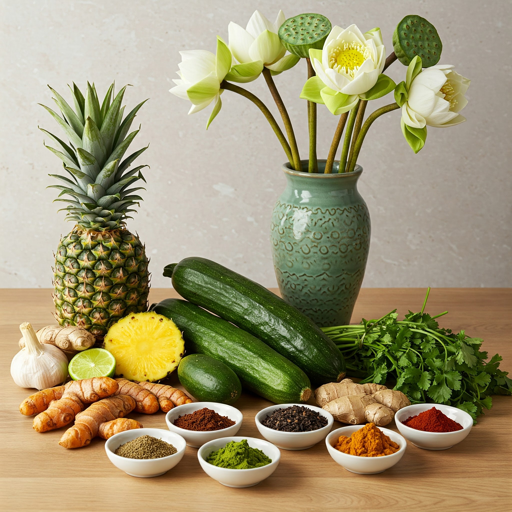
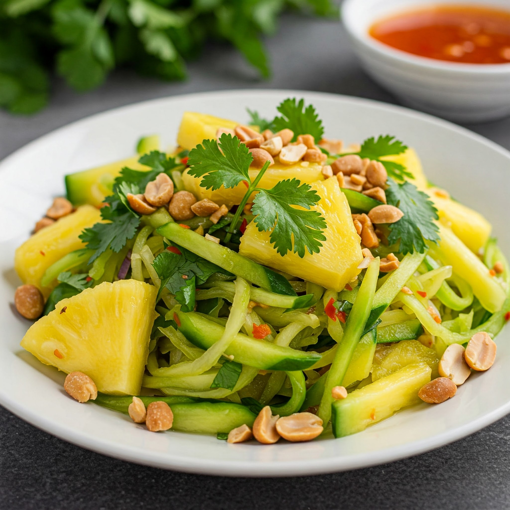
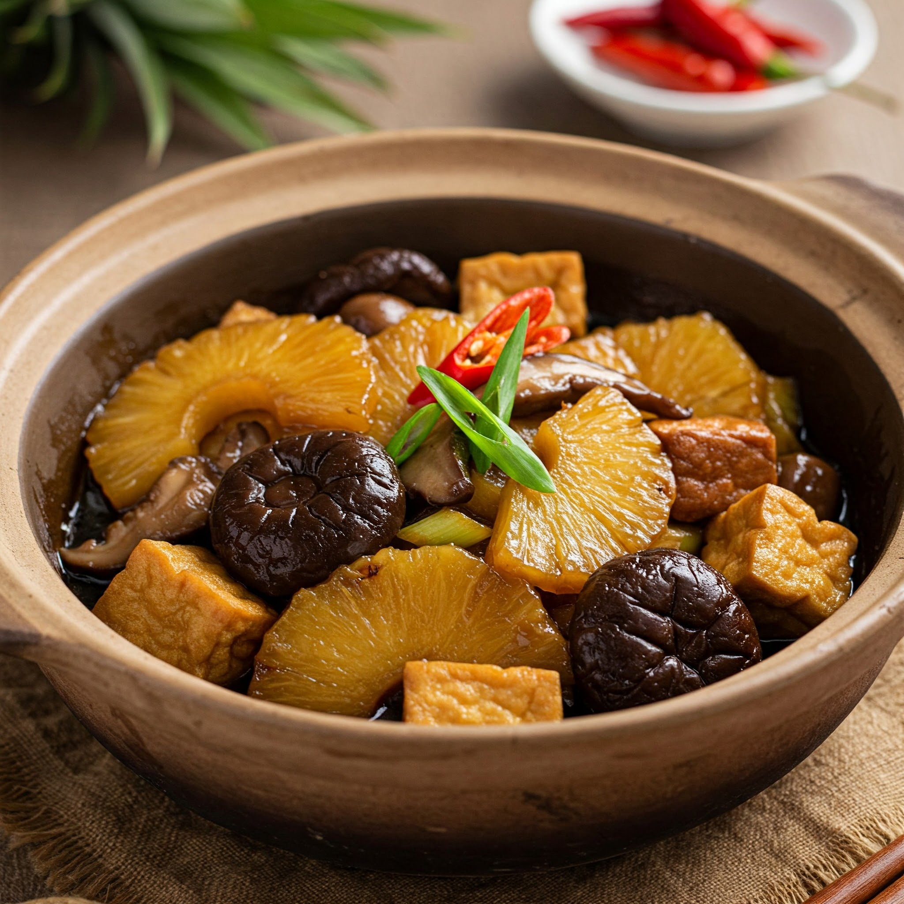
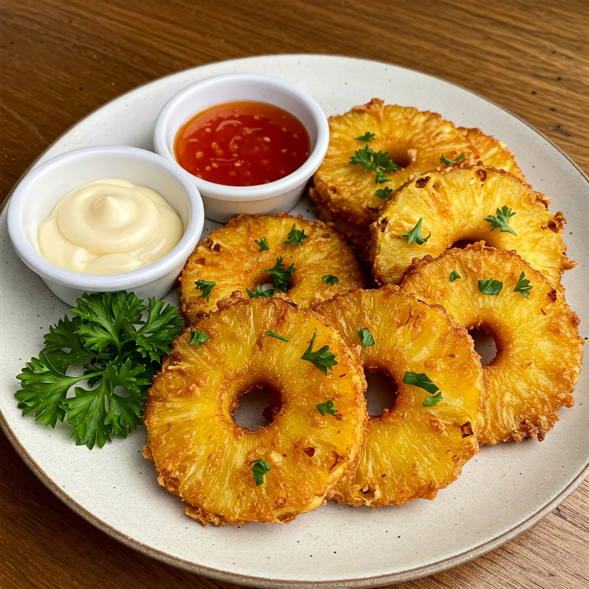
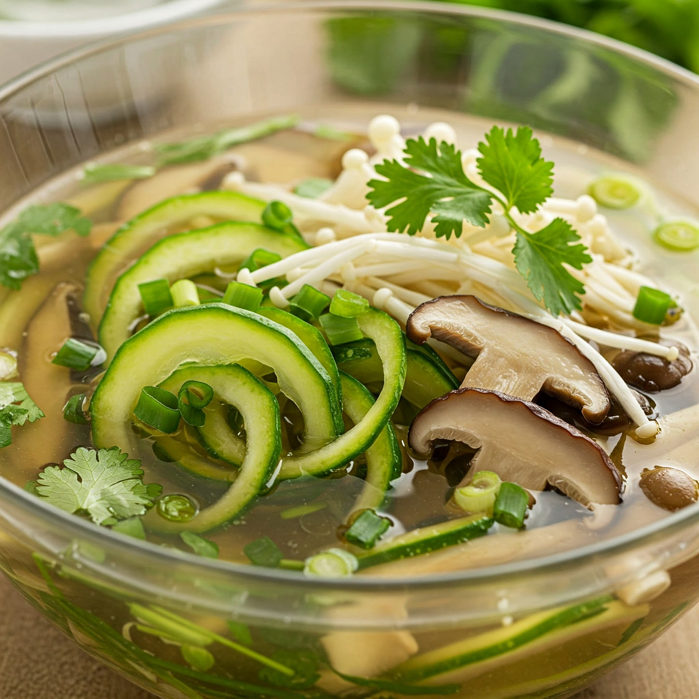
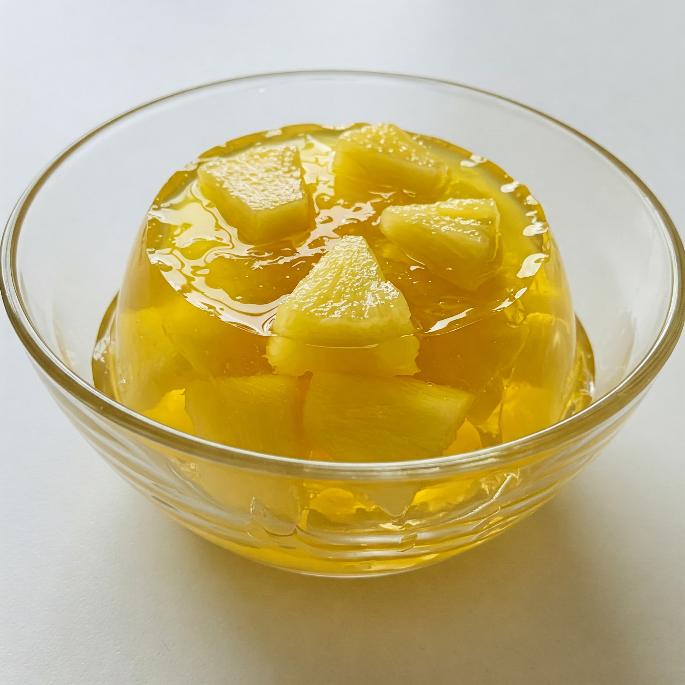

## Khám Phá Hương Vị Tươi Mát: Thực Đơn Chay Dứa Và Bí Xanh

Trong không khí thanh tịnh của những ngày chay, chúng ta luôn tìm kiếm những trải nghiệm ẩm thực vừa độc đáo vừa lành mạnh. Thực đơn chay này sử dụng trái dứa và bí xanh – những nguyên liệu quen thuộc nhưng được biến tấu theo cách sáng tạo để mang đến những hương vị mới lạ, kết hợp giữa thanh mát, ngọt tự nhiên và đậm đà.

---

### Sự Hài Hòa Giữa Vị Ngọt, Chua, Giòn Và Thanh Mát
Thực đơn được chia thành các phần chính:

- **Khai vị:** Gỏi Dứa Bí Xanh Chay  
- **Món chính:** Dứa Kho Chay, Dứa Chiên Giòn  
- **Canh phụ:** Canh Bí Xanh Nấu Nấm  
- **Tráng miệng:** Thạch Dứa Mát Lạnh  

Mỗi món ăn trong thực đơn đều được chế biến tỉ mỉ để giữ trọn hương vị tự nhiên của các nguyên liệu, đồng thời đảm bảo dinh dưỡng tối ưu.

---

## Công Thức Chi Tiết

### 1. Gỏi Dứa Bí Xanh Chay (Khai vị)

**Nguyên liệu:**  
- 200g bí xanh (bào sợi)  
- 150g dứa (thái lát mỏng)  
- 50g cà rốt (bào sợi)  
- Rau thơm: rau răm, húng quế  
- 2 muỗng canh nước mắm chay  
- 1 muỗng cà phê đường  
- 1 quả chanh (vắt lấy nước)  
- Ớt (thái lát), đậu phộng rang giã nhỏ  

**Cách làm:**  
1. Trộn bí xanh, dứa, cà rốt và rau thơm vào tô lớn.  
2. Pha nước mắm chay, đường, nước cốt chanh, ớt thành nước trộn gỏi.  
3. Rưới nước trộn gỏi lên hỗn hợp rau, trộn đều và để thấm gia vị khoảng 10 phút.  
4. Trang trí đậu phộng rang và rau thơm lên trên trước khi thưởng thức.

---

### 2. Dứa Kho Chay (Món chính)

**Nguyên liệu:**  
- 1 chén dứa (thái lát vừa ăn)  
- 100g nấm đông cô (ngâm mềm, thái lát)  
- 200g đậu hũ (cắt miếng nhỏ, chiên sơ)  
- 2 muỗng canh nước tương  
- 1 muỗng cà phê đường  
- Hành, tiêu, ớt băm, dầu ăn  

**Cách làm:**  
- Xào nấm và đậu hũ, thêm dứa và nước tương. Kho đến khi nước sốt sệt.  
- Dùng nóng với cơm trắng.

---

### 3. Dứa Chiên Giòn (Món chính)

**Nguyên liệu:**  
- 1 chén dứa (thái lát dày)  
- 1/2 chén bột chiên giòn  
- 1/4 chén nước soda  
- Dầu ăn  

**Cách làm:**  
- Nhúng dứa vào bột chiên, chiên ngập dầu đến vàng giòn.  
- Dùng kèm sốt chay yêu thích như mayonnaise chay hoặc tương ớt.

---

### 4. Canh Bí Xanh Nấu Nấm (Canh phụ)

**Nguyên liệu:**  
- 300g bí xanh  
- 150g nấm (nấm rơm, nấm kim châm)  
- 500ml nước dùng rau củ  
- Hành lá, ngò để trang trí  

**Cách làm:**  
- Đun nước dùng, thêm bí xanh và nấm. Nêm muối, tiêu, rắc hành ngò lên trên.  

---

### 5. Thạch Dứa Mát Lạnh (Tráng miệng)

**Nguyên liệu:**  
- 200ml nước ép dứa  
- 1 gói bột rau câu  
- 1 muỗng canh đường  

**Cách làm:**  
- Đun nước rau câu với đường, thêm nước ép dứa, đổ vào khuôn và để lạnh.

---

## Lời Kết
Hy vọng thực đơn chay sử dụng dứa và bí xanh sẽ mang đến những trải nghiệm ẩm thực thú vị và bổ dưỡng cho gia đình bạn!

*Lưu ý:*  
- Bạn có thể điều chỉnh lượng gia vị, thời gian nấu và các thành phần theo khẩu vị cá nhân.  
- Việc sử dụng nước dùng rau củ tự nhiên làm nền giúp các món ăn hướng tới vị thanh ngọt và đảm bảo dinh dưỡng tối ưu.

Hy vọng nội dung này phù hợp với yêu cầu của bạn. Nếu cần chỉnh sửa thêm, cứ cho tôi biết nhé! 