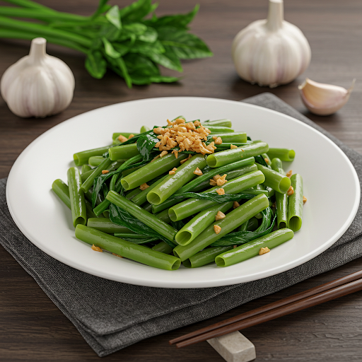

# Thực Đơn Bữa Tối Đơn Giản và Dễ Làm Dành Cho Gia Đình Trong Cả Tuần (Cho 6 người)

**Chào mừng bạn đến với thực đơn bữa tối tuyệt hảo, đơn giản, và dễ làm dành cho gia đình 6 người tại "i-love-cooking"! Với sự đa dạng, phong phú từ các món canh truyền thống Việt Nam đến các món xào và kho đậm đà, thực đơn này không chỉ mang lại hương vị thơm ngon mà còn đảm bảo cân bằng dinh dưỡng cho mọi thành viên trong gia đình. Chúng tôi ưu tiên sử dụng nguyên liệu tươi ngon, dễ tìm tại các chợ địa phương, cùng với hướng dẫn chế biến chi tiết, đơn giản nhưng hiệu quả.**

**Thực đơn bao gồm các món ăn đặc sắc như *canh chua cá lóc*, *thịt kho trứng cút*, *rau xào tỏi*, và nhiều món ăn hấp dẫn khác. Đây là lựa chọn lý tưởng cho những ai yêu thích nấu ăn tại nhà mà vẫn muốn tiết kiệm thời gian chuẩn bị.**

**Nếu bạn đang tìm kiếm ý tưởng cho bữa tối ngon miệng và dễ làm, đừng bỏ qua thực đơn này. Cùng khám phá ngay để tạo nên những bữa cơm gia đình thật ấm cúng!**

## THỰC ĐƠN CHO NGÀY THỨ HAI

Thực đơn cho ngày Thứ Hai mang đến hương vị truyền thống Việt Nam với **canh chua cá lóc**, **thịt kho trứng cút**, và **rau muống xào tỏi**. Sự kết hợp giữa vị chua thanh của canh, vị ngọt đậm đà của thịt kho, và rau xào thơm ngát tạo nên bữa cơm gia đình hoàn hảo, vừa ngon miệng vừa đủ chất dinh dưỡng.

### Món 1: Canh chua cá lóc

- **Nguyên liệu:**
  - Cá lóc: 600g
  - Cà chua: 3 trái
  - Thơm (dứa): 1/2 trái
  - Giá: 200g
  - Đậu bắp: 300g
  - Bạc hà (Dọc mùng): 3 cây
  - Me chua: 50g
  - Ngò tây, Ngò om: 1 bó nhỏ
  - Gia vị: nước mắm, muối, đường, bột ngọt.
- **Cách chế biến:**
  1. Làm sạch cá lóc, cắt khúc, ướp với chút muối.
  2. Phi hành tím, xào cà chua, thơm, cho me vào, đổ nước.
  3. Khi nước sôi, cho cá lóc vào, nêm gia vị vừa ăn.
  4. Cuối cùng, thêm đậu bắp, bạc hà, giá, đun thêm 2 phút, sau đó cho ngò vào.

### Món 2: Thịt kho trứng cút

- **Nguyên liệu:**
  - Thịt ba chỉ: 600g
  - Trứng cút: 12 quả
  - Nước dừa tươi: 300ml
  - Nước mắm, đường, tiêu.
- **Cách chế biến:**
  1. Luộc trứng cút, bóc vỏ.
  2. Thịt ba chỉ thái miếng, ướp với nước mắm, đường.
  3. Kho thịt với nước dừa đến khi cạn sệt, thêm trứng cút.

### Món 3: Rau muống xào tỏi

- **Nguyên liệu:**
  - Rau muống: 500g
  - Tỏi: 2 củ.
- **Cách chế biến:**
  1. Rửa sạch rau muống, cắt khúc.
  2. Phi tỏi thơm, xào rau muống, thêm chút gia vị.

## THỰC ĐƠN CHO NGÀY THỨ BA

Thực đơn cho ngày Thứ Ba đem lại sự đa dạng với **canh cải nấu thịt**, **gà chiên nước mắm**, và **cà tím nướng mỡ hành**. Món canh thanh mát, gà chiên đậm đà, cùng vị béo của cà tím nướng tạo nên bữa tối ấm cúng cho cả nhà.

### Món 1: Canh cải xanh thịt bằm

- **Nguyên liệu:**
  - Rau cải xanh: 1 bó lớn (700g)
  - Thịt băm: 300g
  - Hành tím: 2 củ.
- **Cách chế biến:**
  1. Phi hành tím, cho thịt băm vào xào sơ, đổ nước.
  2. Khi nước sôi, cho rau cải vào, nêm gia vị.

### Món 2: Gà chiên nước mắm

- **Nguyên liệu:**
  - Gà: 600g
  - Tỏi: 2 củ.
  - Nước mắm, đường.
- **Cách chế biến:**
  1. Rửa sạch gà, cắt miếng vừa ăn.
  2. Chiên gà vàng giòn, sau đó rim với hỗn hợp nước mắm và đường.

### Món 3: Cà tím nướng mỡ hành

- **Nguyên liệu:**
  - Cà tím: 3 quả lớn.
  - Hành lá, dầu ăn.
- **Cách chế biến:**
  1. Nướng cà tím trên lửa than hoặc bếp ga.
  2. Rưới mỡ hành lên cà tím sau khi nướng chín.

## THỰC ĐƠN CHO NGÀY THỨ TƯ

Thực đơn cho ngày Thứ Tư là lựa chọn lý tưởng với các món **canh bí đỏ nấu tôm**, **cá kho tộ**, và **đậu phụ chiên giòn**. Canh bí thơm mát, cá kho đậm vị, và đậu chiên giòn rụm mang đến cảm giác ngon miệng và thân thuộc.

### Món 1: Canh bí đỏ nấu tôm

- **Nguyên liệu:**
  - Bí đỏ: 500g
  - Tôm tươi: 300g
  - Hành lá: 1 bó nhỏ
  - Gia vị: muối, đường, bột ngọt.
- **Cách chế biến:**
  1. Bí đỏ gọt vỏ, cắt miếng vừa ăn.
  2. Tôm rửa sạch, bóc vỏ, ướp muối.
  3. Đun nước sôi, cho bí đỏ vào trước, nấu mềm rồi thêm tôm.
  4. Nêm gia vị vừa ăn và thêm hành lá.

### Món 2: Cá kho tộ

- **Nguyên liệu:**
  - Cá basa hoặc cá hồi: 600g
  - Nước mắm, đường, tiêu, dầu ăn.
- **Cách chế biến:**
  1. Rửa sạch cá, cắt khúc, ướp với nước mắm, đường và tiêu.
  2. Phi hành tím, cho cá vào kho cùng nước lọc.
  3. Kho đến khi nước cạn và sánh lại.

### Món 3: Đậu hủ chiên giòn

- **Nguyên liệu:**
  - Đậu hủ: 6 miếng
  - Bột chiên giòn: 1 gói nhỏ (200g)
  - Dầu ăn.
- **Cách chế biến:**
  1. Cắt đậu hủhủ thành miếng vừa ăn, áo đều bằng bột chiên giòn.
  2. Chiên trong dầu nóng đến khi vàng giòn.

## THỰC ĐƠN CHO NGÀY THỨ NĂM

Thực đơn cho ngày Thứ Năm nổi bật với **canh rau ngót nấu thịt băm**, **thịt xào hành tây**, và **dưa chua xào trứng**. Những món ăn đơn giản nhưng giàu dinh dưỡng này rất phù hợp cho bữa tối của cả gia đình.

### Món 1: Canh rau ngót thịt băm

- **Nguyên liệu:**
  - Rau ngót: 1 bó lớn (800g)
  - Thịt heo băm: 300g
  - Gia vị: muối, nước mắm, bột ngọt.
- **Cách chế biến:**
  1. Rửa sạch rau ngót, vò nhẹ để rau mềm hơn.
  2. Phi hành tím, xào thịt băm sơ qua, thêm nước.
  3. Khi nước sôi, cho rau vào, nêm gia vị vừa ăn.

### Món 2: Thịt bò xào hành tây

- **Nguyên liệu:**
  - Thịt bò: 600g
  - Hành tây: 2 củ.
  - Gia vị: dầu hào, tiêu, nước mắm.
- **Cách chế biến:**
  1. Thịt thái lát mỏng, ướp với dầu hào và tiêu.
  2. Phi hành tím, xào thịt cùng hành tây đến khi chín.

### Món 3: Dưa chua xào trứng

- **Nguyên liệu:**
  - Dưa cải muối: 500g
  - Trứng gà: 6 quả
  - Tỏi: 2 củ.
- **Cách chế biến:**
  1. Rửa sạch dưa cải để giảm độ mặn.
  2. Phi tỏi, xào dưa trước, sau đó thêm trứng đánh tan.

## THỰC ĐƠN CHO NGÀY THỨ SÁU

Thực đơn cho ngày Thứ Sáu đem lại hương vị độc đáo với **canh khoai mỡ nấu tôm**, **thịt ba chỉ ram mặn**, và **bắp cải luộc chấm nước mắm**. Đây là sự lựa chọn hoàn hảo để làm phong phú thêm bữa cơm gia đình.

### Món 1: Canh khoai mỡ nấu tôm

- **Nguyên liệu:**
  - Khoai mỡ: 500g
  - Tôm tươi: 300g
  - Hành lá, ngò rí: 1 bó nhỏ mỗi loại.
  - Gia vị: muối, tiêu, bột ngọt.
- **Cách chế biến:**
  1. Gọt vỏ khoai mỡ, cắt miếng nhỏ rồi mài nhuyễn.
  2. Tôm rửa sạch, bóc vỏ, ướp với chút muối và tiêu.
  3. Đun nước sôi, cho khoai mỡ vào khuấy đều, sau đó thêm tôm.
  4. Nêm gia vị và thêm hành lá, ngò rí.

### Món 2: Thịt ba chỉ ram mặn

- **Nguyên liệu:**
  - Thịt ba chỉ: 600g
  - Nước mắm, đường, tiêu.
- **Cách chế biến:**
  1. Thịt ba chỉ thái miếng vừa ăn, ướp với nước mắm, đường, tiêu.
  2. Phi hành tím thơm, cho thịt vào ram đến khi săn lại.
  3. Thêm chút nước lọc, đun đến khi nước sệt và thấm vào thịt.

### Món 3: Bắp cải luộc chấm nước tương tỏi ớt

- **Nguyên liệu:**
  - Bắp cải: 1 cái lớn (khoảng 800g).
- **Cách chế biến:**
  1. Bắp cải thái miếng lớn, rửa sạch.
  2. Luộc trong nước sôi có chút muối khoảng 5 phút.
  3. Chấm kèm nước tương tỏi ớt.

## THỰC ĐƠN CHO NGÀY THỨ BẢY

Thực đơn cho ngày Thứ Bảy bao gồm **canh bí xanh nấu thịt băm**, **chả cá chiên**, và **đậu bắp xào tỏi**. Sự kết hợp giữa vị thanh mát của canh, độ giòn dai của chả cá, và hương thơm đậm đà của đậu bắp khiến bữa ăn thêm hấp dẫn.

### Món 1: Canh bí xanh nấu thịt băm

- **Nguyên liệu:**
  - Bí xanh: 1 quả lớn (khoảng 1kg).
  - Thịt heo băm: 300g.
  - Hành tím: 2 củ.
- **Cách chế biến:**
  1. Bí xanh gọt vỏ, thái miếng vừa ăn.
  2. Phi hành tím, xào thịt băm sơ, thêm nước.
  3. Khi nước sôi, cho bí xanh vào, nêm gia vị vừa ăn.

### Món 2: Chả cá chiên

- **Nguyên liệu:**
  - Chả cá thác lác: 500g.
  - Hành lá, thì là: 1 bó nhỏ mỗi loại.
  - Tiêu.
- **Cách chế biến:**
  1. Trộn chả cá với hành lá, thì là và tiêu, tạo hình vừa ăn.
  2. Chiên trong dầu nóng đến khi vàng đều.

### Món 3: Đậu bắp xào tỏi

- **Nguyên liệu:**
  - Đậu bắp: 500g.
  - Tỏi: 2 củ.
- **Cách chế biến:**
  1. Rửa sạch đậu bắp, cắt lát chéo.
  2. Phi tỏi thơm, xào đậu bắp, thêm chút gia vị.

## THỰC ĐƠN CHO NGÀY CHỦ NHẬT

Thực đơn cho ngày Chủ Nhật giới thiệu các món **canh mồng tơi nấu cua đồng**, **thịt heo quay xào cải chua**, và **trứng chiên hành**. Những món ăn này vừa đậm đà bản sắc Việt vừa phù hợp với khẩu vị gia đình.

### Món 1: Canh mồng tơi nấu cua đồng

- **Nguyên liệu:**
  - Cua đồng xay: 300g
  - Rau mồng tơi: 1 bó lớn (khoảng 800g)
  - Gia vị: muối, nước mắm.
- **Cách chế biến:**
  1. Cua đồng xay lọc lấy nước, bỏ bã.
  2. Đun nước cua, khuấy nhẹ để thịt cua đông lại.
  3. Cho rau mồng tơi đã rửa sạch vào, nêm gia vị vừa ăn.

### Món 2: Thịt heo quay xào cải chua

- **Nguyên liệu:**
  - Thịt heo quay: 500g
  - Dưa cải chua: 400g
  - Tỏi: 2 củ.
- **Cách chế biến:**
  1. Rửa sơ dưa cải chua, để ráo nước.
  2. Phi tỏi, cho thịt heo quay vào xào sơ, sau đó thêm cải chua.
  3. Nêm gia vị và xào thêm 5 phút.

### Món 3: Trứng chiên hành

- **Nguyên liệu:**
  - Trứng gà: 6 quả
  - Hành lá: 1 bó nhỏ.
- **Cách chế biến:**
  1. Đánh tan trứng, thêm hành lá thái nhỏ và chút gia vị.
  2. Chiên trứng trên chảo nóng đến khi chín vàng.

## MỘT THỰC ĐƠN KHÁC CHO GIA ĐÌNH BẠN CÓ THÊM LỰA CHỌN

Thực đơn để bổ sung thêm sự lựa chọn khác mang đến sự tươi ngon với **canh bí xanh nấu tôm**, **cá nục kho cà**, và **rau cải xào tỏi**. Đây là lựa chọn lý tưởng để đổi mới thực đơn với hương vị truyền thống thơm ngon.

### Món 1: Canh bí xanh nấu tôm

- **Nguyên liệu:**
  - Bí xanh: 1 quả lớn (1kg)
  - Tôm tươi: 300g
  - Hành tím: 2 củ.
- **Cách chế biến:**
  1. Bí xanh gọt vỏ, cắt lát mỏng.
  2. Phi hành tím, xào tôm sơ, thêm nước.
  3. Khi nước sôi, cho bí xanh vào, nêm gia vị.

### Món 2: Cá nục kho cà

- **Nguyên liệu:**
  - Cá nục: 600g
  - Cà chua: 3 quả
  - Nước mắm, đường, tiêu.
- **Cách chế biến:**
  1. Cá nục làm sạch, ướp với muối.
  2. Phi hành, xào cà chua, sau đó thêm cá và nước mắm.
  3. Kho đến khi nước cạn và thấm gia vị.

### Món 3: Rau xào tỏi

- **Nguyên liệu:**
  - Rau cải ngọt hoặc cải thìa: 500g
  - Tỏi: 2 củ.
- **Cách chế biến:**
  1. Rửa sạch rau, cắt khúc.
  2. Phi tỏi, xào rau, nêm gia vị vừa ăn.